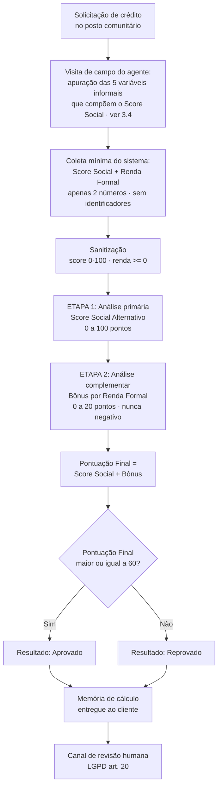

# Sistema de Score de Microcrédito Inclusivo

**LaunchLab UniFAP 2026 · Semana 1 · Célula 5 · Sistemas de Informação**

Algoritmo de triagem de crédito para cooperativa de microcrédito comunitário, projetado para **não excluir trabalhadores do mercado informal**.

| Seção | Conteúdo |
|---|---|
| [1. Como usar](#1-como-usar) | Execução, exemplo de sessão, estrutura, CI |
| [2. Regras — entrada e validação](#2-regras--entrada-e-validação) | O que entra, faixas aceitas, sanitização |
| [3. Como funciona](#3-como-funciona) | Defeito legado, fluxo, fórmula, pesos |
| [4. Conformidade com LGPD](#4-conformidade-com-lgpd-lei-nº-137092018) | Minimização, art. 20, não discriminação |
| [5. Análise de viabilidade](#5-análise-de-viabilidade) | Projeção financeira e ponto de equilíbrio |
| [6. Benefícios](#6-benefícios) | Para a cliente, a cooperativa e a comunidade |
| [7. Base usada e resultados da simulação](#7-base-usada-e-resultados-da-simulação) | Coorte sintética, resultados, ressalvas |
| [8. Conclusão](#8-conclusão) | Síntese |

---

## 1. Como usar

Requisito: **Python 3**. Sem dependências externas, apenas biblioteca padrão.

### Triagem de um solicitante

```bash
python3 src/triagem.py
```

O programa pede dois números no terminal e devolve a decisão com a memória de cálculo:

```
--- SISTEMA DE MICROCRÉDITO INCLUSIVO UniFAP ---
Digite o Score Social Alternativo (0-100): 80
Digite a Renda Formal CLT (R$): 0

----------- MEMORIA DE CALCULO -----------
Score Social Alternativo ..:  80.00 pontos
Bonus por Renda Formal ....:   0.00 pontos (teto: 20)
Pontuacao Final ...........:  80.00 pontos
Limiar de Aprovacao .......:  60.00 pontos
------------------------------------------

Resultado: Aprovado
```

Uma solicitante **sem nenhuma renda formal** é aprovada pelo mérito do seu histórico. Era exatamente esse o caso que o sistema antigo rejeitava.

### Simulação sobre a base sintética

```bash
python3 src/simulacao.py
```

Roda a coorte sintética de 500 solicitantes pelas duas regras (legada e nova) e imprime a comparação, a projeção financeira e a análise de sensibilidade. Os números das seções 5 e 7 saem daqui. Ver [seção 7](#7-base-usada-e-resultados-da-simulação).

### Validação automatizada

O pipeline em `.github/workflows/testes.yml` roda a cada `git push`:

| Caso | Entrada | Esperado |
|---|---|---|
| 1. Informal com bom score | score 80, renda R$ 0 | `Resultado: Aprovado` |
| 2. Baixo score sem renda | score 40, renda R$ 0 | `Resultado: Reprovado` |

O caso 1 é o teste de regressão do defeito original: se alguém reintroduzir a renda formal como critério excludente, ele quebra.

### Estrutura

```
.
├── README.md                      Regras, fluxo, LGPD, viabilidade e simulação
├── .gitignore
├── src/
│   ├── triagem.py                 Motor de triagem (entrada do sistema)
│   └── simulacao.py               Base sintética e projeções
└── .github/workflows/testes.yml   Validação automatizada
```

---

## 2. Regras — entrada e validação

### O que o sistema coleta

O sistema lê **duas informações, e nada mais**:

| # | Entrada | Tipo | Faixa válida | Origem |
|---|---|---|---|---|
| 1 | **Score Social Alternativo** | inteiro | 0 a 100 | Apurado pelo agente de crédito em visita de campo, antes da execução |
| 2 | **Renda Formal CLT** | decimal | ≥ R$ 0,00 | Declarada/comprovada pela solicitante |

Não são pedidos nome, CPF, RG, endereço, telefone, estado civil nem qualquer identificador. A justificativa dessa escolha está na [seção 4.1](#41-minimização-art-6º-iii).

### Regras de validação

| Situação | Tratamento | Motivo |
|---|---|---|
| Score fora de 0–100 | **Clamp** para o limite mais próximo | A CI envia exatamente duas linhas; repetir a pergunta travaria o pipeline |
| Renda negativa | **Clamp** para R$ 0,00 | Renda negativa não é conceito de negócio válido |
| Texto não numérico | Mensagem de erro e encerramento limpo | Evita *traceback* na frente da cliente no balcão |
| Renda igual a R$ 0,00 | **Entrada perfeitamente válida** | É o caso central do público-alvo, não um erro |

```python
def sanitizar_entradas(score_social, renda_formal):
    score_social = max(SCORE_MINIMO, min(score_social, SCORE_MAXIMO))
    renda_formal = max(0.0, renda_formal)
    return score_social, renda_formal
```

> A regra mais importante desta seção é a última linha da tabela: **renda zero não é entrada inválida nem caso de exceção.** É o cenário típico da costureira, da feirante e da diarista que a cooperativa existe para atender.

### Regra de decisão

| Regra | Valor |
|---|---|
| Aprovação | Pontuação Final ≥ 60 pontos |
| Renda formal | Só pode **somar** — nunca subtrai, nunca veta |
| Teto do bônus de renda | 20 pontos |
| Ordem de avaliação | Score social **primeiro**; renda só depois |

---

## 3. Como funciona

### 3.1 O defeito no sistema legado

A cooperativa atendia comunidades periféricas de Macapá com um motor que negava crédito automaticamente a quem não comprovasse renda formal (CLT). O efeito prático foi a exclusão de **95% das mulheres chefes de família** da comunidade: costureiras, feirantes, cozinheiras e diaristas que, apesar de não terem carteira assinada, mantinham histórico exemplar de pagamento no comércio do bairro.

```python
if score_social >= 60:
    if renda_formal > 1500:      # ← porta de exclusão
        print("Resultado: Aprovado")
    else:
        print("Resultado: Reprovado")
else:
    print("Resultado: Reprovado")
```

O aninhamento é um **E lógico**: exigia score alto **E** renda formal. Uma cliente com score social 100 e renda CLT R$ 0,00 caía no `else` interno e era reprovada. O bom histórico de pagamento era coletado, calculado e depois **descartado** pela regra seguinte.

O sistema não estava medindo risco de crédito. Estava medindo **formalidade de vínculo empregatício**, e tratando as duas coisas como se fossem a mesma.

### 3.2 Fluxo do processo de negócio



**Princípio de ordenação.** A renda formal só é consultada **depois** que o score social já produziu sua pontuação, e só pode somar. Não existe caminho no fluxo em que renda baixa ou zero derrube uma decisão que o score social já sustentava. É essa a diferença entre *ponderar* e *excluir*.

### 3.3 Modelo de pontuação e justificativa dos pesos

```
Pontuação Final = Score Social Alternativo + Bônus de Renda Formal

Bônus de Renda = min(renda_formal / 1500 ; 1,0) × 20

Aprovado  ⟺  Pontuação Final >= 60
```

| Parâmetro | Valor | Onde fica |
|---|---|---|
| `LIMIAR_APROVACAO` | 60,0 pontos | `src/triagem.py` |
| `PESO_MAX_RENDA` | 20,0 pontos | `src/triagem.py` |
| `RENDA_REFERENCIA` | R$ 1.500,00 | `src/triagem.py` |

Os três parâmetros estão isolados no topo do módulo, como constantes nomeadas. O comitê de crédito consegue recalibrar a política **sem tocar na lógica do algoritmo**, o que torna cada mudança de política um diff pequeno, legível e auditável no histórico do Git.

**Por que o score social pesa 100 e a renda pesa no máximo 20.** O score social carrega peso integral porque é o **preditor direto**: resume comportamento observado de adimplência. É *evidência de pagamento*. A renda CLT é apenas um *proxy* de capacidade de pagamento, e um proxy fraco: um assalariado superendividado com renda de R$ 3.000 é pior risco que uma feirante com R$ 0 de CLT e 12 anos de contas em dia.

**Por que a renda ainda vale 20 pontos.** Renda formal indica uma segunda fonte de recursos, independente do negócio: funciona como colchão em caso de sazonalidade ou choque na renda informal. É motivo legítimo para reforçar a nota, e motivo nenhum para vetar.

**O teto é a peça de contenção de risco.** Sem ele, renda suficientemente alta compraria a aprovação de qualquer solicitante. Com o teto em 20, quem tem score social 30 chega no máximo a 50 pontos, abaixo do limiar, **independentemente de ganhar R$ 3.000 ou R$ 100.000**.

**A saturação em R$ 1.500 (≈ 1 salário mínimo) reflete rendimento decrescente.** A diferença de segurança entre R$ 0 e R$ 1.500 é grande; entre R$ 5.000 e R$ 8.000, é irrelevante para um crédito de ticket médio R$ 1.200.

**O limiar de 60 preserva o corte de risco original.** A reforma não afrouxou a régua; moveu o *critério*. Quem tinha score social suficiente sob a regra antiga continua aprovado; quem era barrado apenas por falta de carteira assinada deixa de ser.

### 3.4 Composição do Score Social: pesos das variáveis informais

O Score Social (0 a 100) é o **insumo** do algoritmo, apurado pelo agente de crédito comunitário na visita de campo, antes da execução do script. Sua composição é regra de negócio documentada, não código, e é aqui que as variáveis alternativas de comportamento recebem peso:

| # | Variável informal | Peso | Como é apurada | Por que pesa isso |
|---|---|---:|---|---|
| 1 | **Pontualidade em contas recorrentes** | 30 | Comprovantes de água, luz, aluguel e declaração de fiado no comércio local (12 meses) | Maior peso individual: é **evidência direta e verificável** de adimplência. Não é proxy de nada: é o próprio comportamento que se quer prever |
| 2 | **Tempo de atuação no negócio e na comunidade** | 20 | Declaração de associação de moradores ou de dois comerciantes vizinhos | Proxy de resiliência. Um negócio que sobreviveu 10 anos na periferia já atravessou choques que quebraram concorrentes |
| 3 | **Regularidade do fluxo de caixa** | 20 | Caderno de vendas, extrato de maquininha ou registro de Pix (3 meses) | Mede **capacidade** real de pagamento, o papel que a renda CLT cumpriria, medido na fonte certa para quem é informal |
| 4 | **Referências comunitárias** | 15 | Duas referências de fornecedores, clientes fixos ou lideranças locais | Capital social. Em microcrédito comunitário, a reputação no bairro funciona como **garantia reputacional** e substitui a garantia real que este público não tem |
| 5 | **Histórico com a própria cooperativa** | 15 | Contratos anteriores quitados na instituição | O melhor preditor existente, quando existe. Peso contido de propósito (ver nota abaixo) |
| | **Total** | **100** | | |

**Por que a pontualidade (30) pesa mais que tudo:** o objetivo do redesenho é substituir um critério de *formalidade* por um critério de *comportamento*. A variável 1 é a mais próxima do evento que se quer prever: pagar em dia. As variáveis 2 e 3 medem sustentação do negócio; a 4 mede pressão social; a 1 mede o histórico do próprio ato de pagar.

> ⚠️ **Verificação de exclusão embutida: cliente novo.** Quem nunca tomou crédito na cooperativa zera a variável 5 e alcança no máximo **85 pontos** (30+20+20+15). Como 85 > 60, **o cliente de primeira viagem continua aprovável** por mérito das variáveis 1 a 4. Isso foi calibrado deliberadamente: um peso maior na variável 5 recriaria uma exclusão nova, a do recém-chegado, reproduzindo o defeito que este projeto veio corrigir, só que em outra porta. Nenhuma variável isolada pode ter poder de veto.

**Variáveis vedadas na composição.** Não podem entrar no score, sob nenhuma justificativa técnica: bairro ou logradouro de residência, sobrenome, origem racial, religião ou frequência a templo, filiação sindical ou partidária, estado civil, número de filhos, dado de saúde ou deficiência. São *proxies de característica protegida*: reintroduziriam discriminação indireta sob aparência de neutralidade estatística, exatamente como a exigência de CLT fazia. Ver seções 4.2 e 4.5.

### 3.5 Cenários

| Perfil | Score Social | Renda CLT | Bônus | Final | Resultado |
|---|---:|---:|---:|---:|---|
| Costureira, 12 anos no bairro, contas em dia | 100 | R$ 0 | 0,00 | 100,00 | **Aprovado** |
| Feirante com bom histórico | 80 | R$ 0 | 0,00 | 80,00 | **Aprovado** |
| Mecânico informal, histórico regular | 60 | R$ 0 | 0,00 | 60,00 | **Aprovado** |
| Histórico mediano + meio salário CLT | 50 | R$ 750 | 10,00 | 60,00 | **Aprovado** |
| Histórico mediano + CLT integral | 50 | R$ 3.000 | 20,00 | 70,00 | **Aprovado** |
| Histórico mediano, sem renda formal | 50 | R$ 0 | 0,00 | 50,00 | Reprovado |
| Histórico fraco | 40 | R$ 0 | 0,00 | 40,00 | Reprovado |
| **Histórico ruim + renda muito alta** | 30 | R$ 100.000 | 20,00 | 50,00 | **Reprovado** |

As duas linhas que resumem o projeto: a terceira prova que **renda zero não impede** aprovação (problema resolvido); a última prova que **renda alta não compra** aprovação (o modelo não virou porta escancarada).

---

## 4. Conformidade com LGPD (Lei nº 13.709/2018)

O público atendido é composto por pessoas em situação de vulnerabilidade socioeconômica, para quem um vazamento de dados financeiros tem consequências desproporcionais, desde constrangimento comunitário até exposição a agiotagem e golpes dirigidos. A proteção de dados aqui é **requisito de produto**, não formalidade jurídica.

### 4.1 Minimização (art. 6º, III)

O sistema coleta **duas variáveis numéricas e nada mais**: o Score Social Alternativo e a Renda Formal. Não pede nome, CPF, RG, endereço, telefone, estado civil, nome de familiares nem foto.

Consequência direta: **os dados processados na triagem são, isoladamente, anônimos.** Um dump completo da entrada do sistema seria um par de números sem titular identificável. É a defesa mais forte possível: o dado que não existe não vaza.

### 4.2 Ausência de dados sensíveis (art. 5º, II)

Nenhuma variável de origem racial, convicção religiosa, opinião política, filiação sindical, dado de saúde, vida sexual, genético ou biométrico entra no cálculo.

Esse ponto exige vigilância permanente na composição do Score Social a montante. Variáveis de comportamento comunitário podem funcionar como **proxies discriminatórios**: frequência a determinado templo, bairro de residência, sobrenome, participação em associação. A cooperativa deve manter e publicar a lista de variáveis admitidas no score, com veto explícito a proxies de característica protegida (ver seção 3.4).

### 4.3 Base legal (art. 7º, V)

O tratamento se dá para **execução de procedimentos preliminares a contrato, a pedido do titular**: a própria solicitação de crédito. Não se apoia em consentimento genérico, o que evita a coleta oportunista de dados alheios à finalidade.

### 4.4 Decisão automatizada e direito à revisão (art. 20)

O art. 20 garante ao titular o direito de solicitar revisão de decisões tomadas exclusivamente por tratamento automatizado que afetem seus interesses. O sistema implementa isso de duas formas:

- **Explicabilidade por construção.** O programa imprime a *memória de cálculo*: score de origem, bônus aplicado, pontuação final e limiar. A cliente vê exatamente por que foi aprovada ou negada, em números. Não existe caixa-preta.
- **Encaminhamento ativo.** Toda reprovação exibe a informação do direito à revisão humana. O modelo é ferramenta de *triagem*, não a palavra final: casos limítrofes e contestações vão ao analista de crédito.

O algoritmo é determinístico e legível em uma linha de aritmética. Isso é escolha deliberada de governança: um modelo estatístico opaco (rede neural, *gradient boosting*) poderia ganhar acurácia marginal ao custo de tornar o art. 20 impossível de cumprir de boa-fé.

### 4.5 Não discriminação (art. 6º, IX)

A LGPD veda o tratamento de dados para fins discriminatórios ilícitos ou abusivos. O sistema legado, ao usar formalidade de vínculo como veto, produzia **discriminação indireta de gênero e classe**: critério neutro no texto, efeito desproporcional sobre mulheres chefes de família. Eliminar esse veto é o cumprimento material do inciso, e o motivo de existir deste projeto.

**Monitoramento contínuo:** a cooperativa deve auditar trimestralmente as taxas de aprovação segmentadas por gênero e faixa de renda, sobre dados agregados e anonimizados, para detectar *disparate impact* residual antes que ele se consolide.

### 4.6 Segurança, retenção e ciclo de vida (arts. 46 e 16)

| Controle | Aplicação |
|---|---|
| Persistência | O script de triagem **não grava dados em disco**: processa em memória e encerra |
| Segregação | Dados cadastrais ficam no sistema da cooperativa; a triagem recebe apenas o par de números |
| Controle de acesso | Perfis por função, com credencial individual; sem contas compartilhadas em posto de atendimento |
| Trilha de auditoria | Registro de acessos e alterações de parâmetro versionado no Git |
| Criptografia | Em trânsito (TLS) e em repouso, na base cadastral a montante |
| Retenção | Prazo definido por obrigação regulatória do contrato de crédito; eliminação ao término (art. 16) |
| Relatórios | Somente dados agregados e anonimizados, nunca registros individuais |

### 4.7 Papéis e responsabilidades

- **Controlador:** a cooperativa de microcrédito, que decide finalidade e meios do tratamento.
- **Operadores:** agentes de crédito comunitários e prestadores de tecnologia.
- **Encarregado (DPO):** designado formalmente, com canal de contato publicado no posto de atendimento **e em linguagem acessível**: cartaz físico e atendimento presencial, não apenas e-mail em rodapé de site. A titular precisa conseguir exercer seus direitos (arts. 18 e 19) no balcão onde pediu o crédito.

---

## 5. Análise de viabilidade

> ⚠️ **Números derivados de simulação, não de histórico real.** O volume de contratos vem da coorte sintética descrita na [seção 7](#7-base-usada-e-resultados-da-simulação); as premissas financeiras são estimativas de mercado. Ambos devem ser substituídos pelos dados históricos da cooperativa antes de qualquer decisão de investimento. O que esta seção demonstra é o **método**.

### Premissas financeiras

| Variável | Valor | Origem |
|---|---:|---|
| Solicitações por mês | 500 | Premissa de porte do posto |
| **Contratos destravados pelo novo modelo** | **296/mês** | **Saída da simulação (§7)** |
| Ticket médio | R$ 1.200,00 | Premissa |
| Prazo | 12 meses (Tabela Price) | Premissa |
| Taxa de juros | 2,5% a.m. | Premissa |
| Inadimplência esperada | 8% | Premissa conservadora (ver abaixo) |
| Custo operacional por contrato | R$ 60,00 | Premissa |

**Sobre a inadimplência de 8%:** a premissa é conservadora de propósito. Ela assume que o público informal aprovado terá desempenho *pior* que a carteira atual, mesmo sendo composto por pessoas selecionadas justamente por histórico comprovado de pagamento. Se o Score Social tiver poder preditivo real — e essa é a hipótese central do projeto — o número tende a ficar abaixo disso.

### Cálculo

Juros totais por contrato (Price, 2,5% a.m. × 12 meses) = **16,98% do principal** ≈ R$ 203,81

| Componente | Mensal | Anual |
|---|---:|---:|
| Volume adicional desembolsado | R$ 355.200,00 | R$ 4.262.400,00 |
| (+) Receita de juros | R$ 60.329,13 | R$ 723.949,56 |
| (−) Perda esperada por inadimplência (8%) | −R$ 28.416,00 | −R$ 340.992,00 |
| (−) Custo operacional (296 × R$ 60) | −R$ 17.760,00 | −R$ 213.120,00 |
| **= Resultado líquido incremental** | **R$ 14.153,13** | **R$ 169.837,56** |

### Ponto de equilíbrio

```
Inadimplência máxima suportada = (Receita de juros − Custo operacional) / Volume desembolsado
                               = (60.329,13 − 17.760,00) / 355.200,00
                               = 11,98%
```

**A operação suporta até 11,98% de inadimplência antes de gerar prejuízo.** Contra a estimativa conservadora de 8%, isso deixa **4 pontos percentuais de margem de segurança** — folga de 50% sobre o cenário-base. A expansão é economicamente sustentável mesmo se o desempenho do público informal frustrar a expectativa.

Note que o ponto de equilíbrio **não depende do volume**: é uma razão entre receita e principal por contrato. Ele vale mesmo que a simulação erre feio na quantidade de contratos destravados.

---

## 6. Benefícios

### Para a cliente

- **Acesso ao crédito por mérito próprio.** O histórico de pagamento que ela construiu no bairro passa a valer alguma coisa. Antes era coletado e descartado.
- **Decisão transparente.** Ela recebe a memória de cálculo em números, não um "negado" sem explicação — e sai sabendo de quanto foi sua pontuação e do quanto faltou.
- **Direito à revisão garantido.** Toda reprovação informa ativamente o canal humano (LGPD, art. 20).
- **Caminho de melhoria visível.** Como os pesos são públicos (§3.4), ela sabe o que fazer para melhorar sua pontuação no próximo ciclo. Um veto por CLT não oferecia caminho nenhum.

### Para a cooperativa

- **Custo de aquisição já afundado.** Os ~296 clientes/mês **já chegaram** ao balcão e já foram analisados. Todo o custo de aquisição e triagem foi pago, e depois jogado fora pela regra de veto. Convertê-los tem CAC marginal próximo de zero: é a expansão mais barata disponível.
- **Valor de ciclo de vida (LTV).** O microcrédito é produto de recorrência: quem quita o primeiro contrato normalmente renova com ticket maior. A análise da §5 captura apenas o **primeiro ciclo de 12 meses**. O valor presente de uma cliente que renova por cinco anos com ticket crescente é múltiplo do número apresentado.
- **Risco reputacional e regulatório evitado.** Manter um critério que rejeita 95% das mulheres chefes de família expõe a cooperativa a questionamento por discriminação indireta, sob a LGPD (art. 6º, IX) e sob a legislação de defesa do consumidor. O custo de um passivo desses não aparece na DRE até o dia em que aparece de uma vez.
- **Política auditável e recalibrável.** Os três parâmetros são constantes nomeadas: mudar a régua é um diff pequeno e rastreável no Git, não uma refatoração.

### Para a comunidade

- **R$ 4,26 milhões/ano em crédito produtivo** injetados na economia periférica de Macapá, no cenário simulado — capital de giro que vira estoque de feira, máquina de costura, ferramenta de oficina.
- **Correção de uma discriminação indireta de gênero**, já que o veto por CLT recaía desproporcionalmente sobre mulheres chefes de família.
- **Cumprimento de missão institucional.** Uma cooperativa de microcrédito comunitário existe para financiar quem o sistema bancário tradicional não alcança. O critério antigo replicava exatamente a exclusão que a instituição foi criada para combater.

---

## 7. Base usada e resultados da simulação

### 7.1 Qual base foi usada

**Não existe base histórica real da cooperativa disponível** para este trabalho. Em vez de estimar números à mão, foi construída uma **coorte sintética de 500 solicitantes**, gerada por `src/simulacao.py` com semente fixa (42), portanto **reproduzível**: qualquer pessoa que rode o script obtém exatamente os mesmos números apresentados aqui.

A simulação não reimplementa a regra: ela **importa a função `avaliar()` do próprio `src/triagem.py`**. O que é medido é o código que roda em produção, não uma cópia dele.

**Composição da coorte:**

| Segmento | Fatia | Renda formal CLT |
|---|---:|---|
| `informal_puro` | 60% | R$ 0,00 |
| `renda_parcial` | 22% | Uniforme entre R$ 200 e R$ 1.500 |
| `formal_pleno` | 18% | Lognormal truncada em R$ 1.500 (mediana ≈ R$ 1.808) |

**Distribuição do Score Social:** Beta(5, 3) reescalada para 0–100 — média 62,5 pontos, assimétrica à direita. Traduz a premissa de que a maioria do público paga suas contas em dia.

**Ancoragem em dado público.** A taxa de informalidade brasileira foi de **38,1% da população ocupada em 2025** (PNAD Contínua/IBGE), com os estados do Norte no topo do ranking: Pará 56,7% e Amazonas 51,6% no 4º trimestre. **O número específico do Amapá não foi localizado nos releases consultados**, e a fatia de 82% de informais/renda parcial usada na coorte é premissa da cooperativa, não estatística do IBGE: o público que procura microcrédito comunitário em área periférica é autosselecionado e muito mais informal que a média da UF.

### 7.2 Premissa crítica — e o que a simulação NÃO prova

> ⚠️ O Score Social é sorteado da **mesma distribuição para os três segmentos**, independente do vínculo formal. Ou seja: a simulação **assume como verdadeira** a hipótese central do projeto — formalidade não prediz adimplência — em vez de demonstrá-la.
>
> Isso é uma limitação honesta e incontornável sem dados reais. A simulação mede corretamente **o efeito da mudança de regra sobre uma população dada**; ela não valida o poder preditivo do Score Social. Essa validação exige acompanhar a inadimplência real da safra aprovada por pelo menos 12 meses.

### 7.3 Resultados: regra legada vs regra nova

Coorte de 500 solicitantes, semente 42:

| Métrica | Regra legada | Regra nova | Δ |
|---|---:|---:|---:|
| Aprovados | 51 (10,2%) | 347 (69,4%) | **+296** |
| Rejeitados | 449 (89,8%) | 153 (30,6%) | −296 |
| **Aprovações retiradas** | — | **0** | — |

### 7.4 Resultados por segmento

| Segmento | Total | Aprovados (legado) | Aprovados (novo) | % legado | % novo |
|---|---:|---:|---:|---:|---:|
| `informal_puro` | 277 | 0 | 162 | 0,0% | **58,5%** |
| `renda_parcial` | 128 | 0 | 103 | 0,0% | **80,5%** |
| `formal_pleno` | 95 | 51 | 82 | 53,7% | **86,3%** |

Duas leituras importantes:

1. **A regra legada aprovava 0% dos informais.** Não "poucos": zero. Nem a costureira com score 100 passava, porque a renda formal era condição necessária. É a demonstração numérica de que o critério era um **veto**, não um peso.
2. **Nenhum segmento perdeu.** O `formal_pleno` também sobe (53,7% → 86,3%), porque quem tinha renda mas score entre 40 e 59 agora consegue fechar a conta com o bônus. A reforma não redistribuiu acesso entre grupos: ampliou para todos, retirando um filtro que não media risco.

### 7.5 Análise de sensibilidade (50 coortes)

Um resultado bom em uma única coorte pode ser sorte da semente. Repetindo a simulação com 50 sementes diferentes:

| Métrica | Mínimo | Média | Máximo |
|---|---:|---:|---:|
| Aprovação — regra legada | 8,0% | 11,0% | 14,8% |
| Aprovação — regra nova | 65,0% | 69,4% | 72,6% |
| Contratos destravados | 270 | 292 | 310 |

**Aprovações retiradas pela regra nova: 0, nas 50 coortes (25.000 solicitantes simulados).**

Essa última linha é a propriedade mais forte verificada aqui. Ela confirma no comportamento o que a álgebra já garantia: como o bônus de renda **nunca é negativo**, `score + bônus >= score`. Ninguém que a regra antiga aprovava pode ser reprovado pela nova. A reforma é **estritamente inclusiva** — não há perdedores.

### 7.6 Reprodução

```bash
python3 src/simulacao.py
```

Todas as premissas são constantes nomeadas no topo de `src/simulacao.py`. Alterar a composição da coorte, o limiar ou as premissas financeiras e rodar de novo é o procedimento previsto para o comitê de crédito testar cenários.

---

## 8. Conclusão

O sistema legado cometia um erro de **medição**, não de código: usava formalidade de vínculo empregatício como se fosse risco de crédito. O aninhamento `if` era só a forma que esse erro assumia em Python.

A correção foi mover o critério, não afrouxar a régua. O limiar segue em 60 pontos. O que mudou é o que conta para chegar lá: comportamento de pagamento observado, com a renda formal rebaixada de veto a bônus limitado a 20 pontos. A simulação mostra o efeito disso sobre a população-alvo — a aprovação de trabalhadores informais sai de **0% para 58,5%**, sem que **uma única** aprovação anterior seja retirada.

Os três resultados que sustentam a entrega:

1. **Resolve o problema.** Renda zero deixa de impedir aprovação. Score 100 sem CLT é aprovado.
2. **Não abre a porteira.** O teto de 20 pontos garante que score 30 com renda de R$ 100.000 continue reprovado. Renda alta não compra crédito.
3. **Não tem perdedor.** Verificado em 25.000 solicitantes simulados: ninguém aprovado pela regra antiga é reprovado pela nova.

No cenário simulado, isso significa **R$ 4,26 milhões/ano** em crédito produtivo na economia periférica e **R$ 169,8 mil/ano** de resultado líquido incremental, com 4 p.p. de folga até o ponto de equilíbrio.

A limitação honesta permanece registrada na §7.2: a simulação assume o poder preditivo do Score Social em vez de prová-lo, e só o acompanhamento da inadimplência real da safra aprovada pode validá-lo. Mas a conclusão de política pública não depende disso. Mesmo sob a premissa conservadora de 8% de inadimplência, a operação fecha com margem: **não há trade-off entre justiça e sustentabilidade financeira. A exclusão dos informais honestos era, ela própria, o desperdício.**

---

**Fontes**

- [PNAD Contínua: taxas anuais de desocupação são as menores da série em 20 unidades da federação — IBGE](https://agenciadenoticias.ibge.gov.br/agencia-sala-de-imprensa/2013-agencia-de-noticias/releases/45920-pnad-continua-taxas-anuais-de-desocupacao-sao-as-menores-da-serie-em-20-unidades-da-federacao)
- [PNAD Contínua Trimestral: desocupação recua em seis das 27 UFs no 4º trimestre de 2025 — IBGE](https://agenciadenoticias.ibge.gov.br/agencia-sala-de-imprensa/2013-agencia-de-noticias/releases/45908-pnad-continua-trimestral-desocupacao-recua-em-seis-das-27-ufs-no-4-trimestre-de-2025)
- [Lei nº 13.709/2018 (LGPD) — Planalto](https://www.planalto.gov.br/ccivil_03/_ato2015-2018/2018/lei/l13709.htm)
